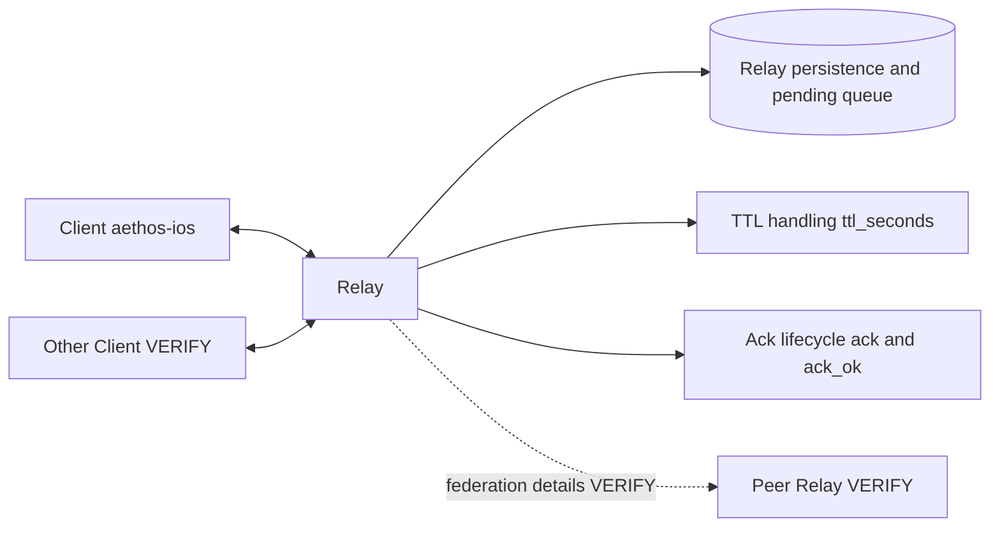
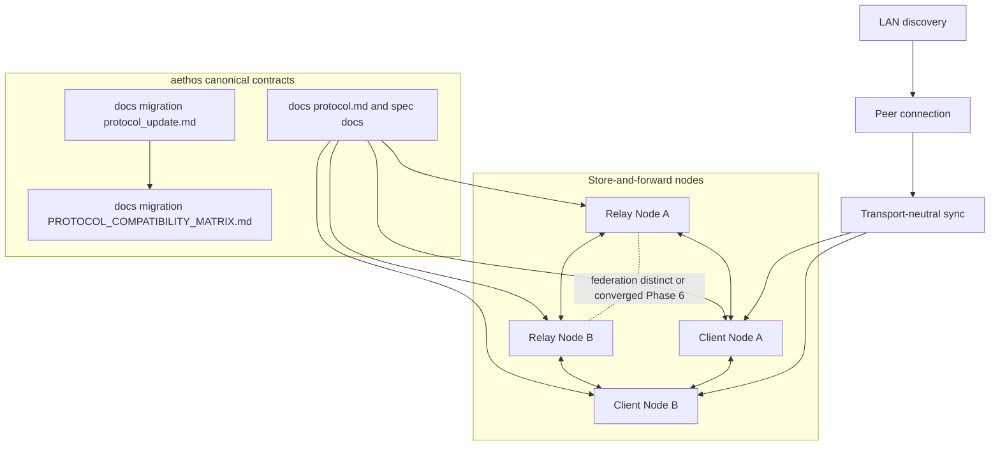

# Protocol Migration Architecture

## Overview

This document captures the current and target protocol architecture used by migration beads.

Supporting docs:

- [Protocol Migration Roadmap](./protocol_update.md)
- [Protocol Compatibility Matrix](./PROTOCOL_COMPATIBILITY_MATRIX.md)

Canonical references:

- [Core protocol structures and canonical bytes](../protocol.md)
- [RelayLink v0.1 historical contract](../relay-contract-v0.1.md)

## Current-state architecture

Current behavior is relay-centric: clients connect to relays, relays persist pending messages, TTL is relay-managed, and delivery completion is represented through `ack`/`ack_ok` semantics.

Federation details are not yet documented as canonical behavior in this repo; track them as `VERIFY` in the matrix.

## Target-state architecture

Target behavior is contract-centric and transport-neutral: `aethos` docs define semantics, relays and clients act as nodes that can hold/forward data, and LAN discovery can trigger direct sync sessions.

## Migration direction

- Phase 0-1: establish source-of-truth docs and divergence tracking.
- Phase 2-3: stabilize relay behavior and align field-level semantics.
- Phase 4: implement `GOSSIP_SYNC_V1` behavior (currently deferred in matrix).
- Phase 5: add LAN discovery and local peer sync triggers.
- Phase 6: decide federation convergence path and codify semantics.

## Design principles

- Canonical protocol rules live in `aethos` docs, not runtime repos.
- Migration decisions require citations or explicit `VERIFY` markers.
- Compatibility changes are staged and bead-sized.
- Sync behavior is transport-neutral; discovery remains implementation-specific.

## Related docs

- [Protocol Migration Roadmap](./protocol_update.md)
- [Protocol Compatibility Matrix](./PROTOCOL_COMPATIBILITY_MATRIX.md)
- [Core protocol structures and canonical bytes](../protocol.md)
- [RelayLink v0.1 historical contract](../relay-contract-v0.1.md)
